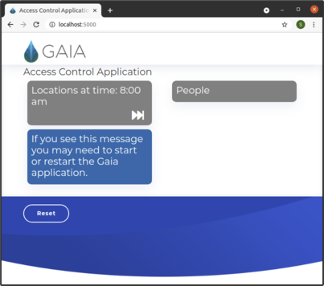
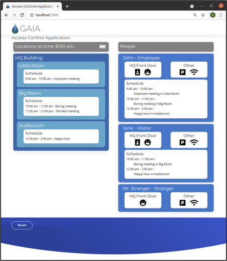

# Gaia Platform: Access Control Application
A demonstration of the Gaia Platform database working with declarative rules to run an access control system for an imaginary building.

This project involves running 3 components:
* The Gaia platform itself.
* The Gaia application containing the declarative C++ code to implement the logic of the building security. E.g. - Requirements for how a person is authenticated and authorized when trying to enter a building or room.
* A building simulator and UI running as a Python 3 Flask application to visualize and test behaviors associated with people entering and moving about a building.

## Pre-requisites
Ubuntu 20.04

Follow the [Gaia](https://www.gaiaplatform.io/) getting started instructions [here](https://gaia-platform.github.io/gaia-platform-docs.io/articles/getting-started-with-gaia.html) for installing and validating your Gaia installation. (Note that this is currently for the pre-release version of Gaia built in March 2021)

The simulator requires Python 3 and Flask

## Launch the simulator UI
Change to UI directory, install requirements and launch the simulator:
```
cd ui
pip install -r requirements.txt
./start_simulator.sh
```
Open a browser to http://localhost:5000 and you should see a page like this:



## Build and launch the Gaia application
From inside the repo, build the application:
```
mkdir build
cd build
cmake ..
make -j$(nproc)
```

Run the application while still in the `build` directory:
```
./access_control
```

Now when you go back to the UI in your browser it should look like this and it can be interacted with by clicking on elements on the page:



## Experiment!
Now that everything is running the Gaia [rules](./src/access_control.ruleset) can be modified and extended to change behaviors. We encourage you to experiment to see how changes affect behavior and to imagine how Gaia could be used for other project ideas you may have.

If you have any questions or feedback please reach out to us at Gaia at info@gaiaplatform.io or directly to the author of this example at steve@gaiaplatform.io
